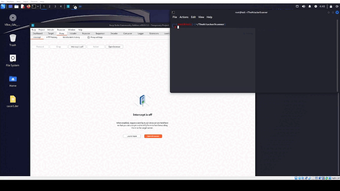
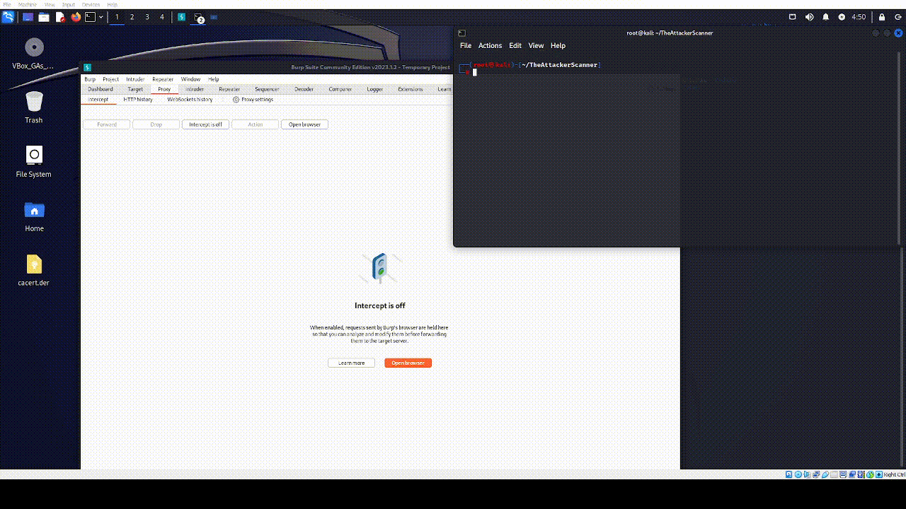
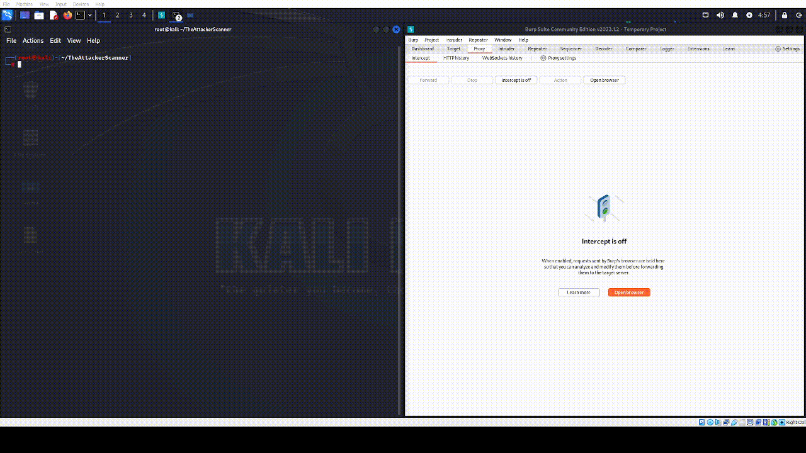

# TheAttackerScanner
Simple Tool for webhacking 

The Main Function of this Tool is scanning Urls for SQLI but it has  some helpful functions

## Installation For windows

1. Install Python 3.x from the official Python website: https://www.python.org/downloads/
2. Clone this repository using Git:https://github.com/TheNewAttacker64/TheAttackerScanner/
3. py -3 -m pip install -r req.txt

## Installation For Linux

1. Clone this repository using Git:https://github.com/TheNewAttacker64/TheAttackerScanner/
2. chmod +x install.sh && sudo ./install.sh

### Simple commands
 
- `theattacker --url http://site.com/example.php?id=1`
- `theattacker urlslist.txt`

### Advanced usage

The tool supports several advanced options to customize the scan:

- `--payload` - Specify a custom SQL injection payload to use
- `--use-cookies` - Use cookies in requests
- `--num-threads` - Specify the number of threads to use (default is 10)
- `--proxy` - Specify a proxy to use for requests (format: `http://proxyserver:port`)
- `--random-user-agent` - Generate a random user agent for each request
- `--cert-path` this option for who want to check the request with burpsuite

To see the full list of options, use the `--help` option:

## Burp Suite Certificate Conversion

If you want to use a Burp Suite certificate with the `--proxy` option, you may need to convert the certificate to a format supported by this tool (PEM format). To do this, use the `--convert-burpcert` option:

### Examples

OneUrl:

LoadingUrlsFromlist:

UsingWithBurp:

